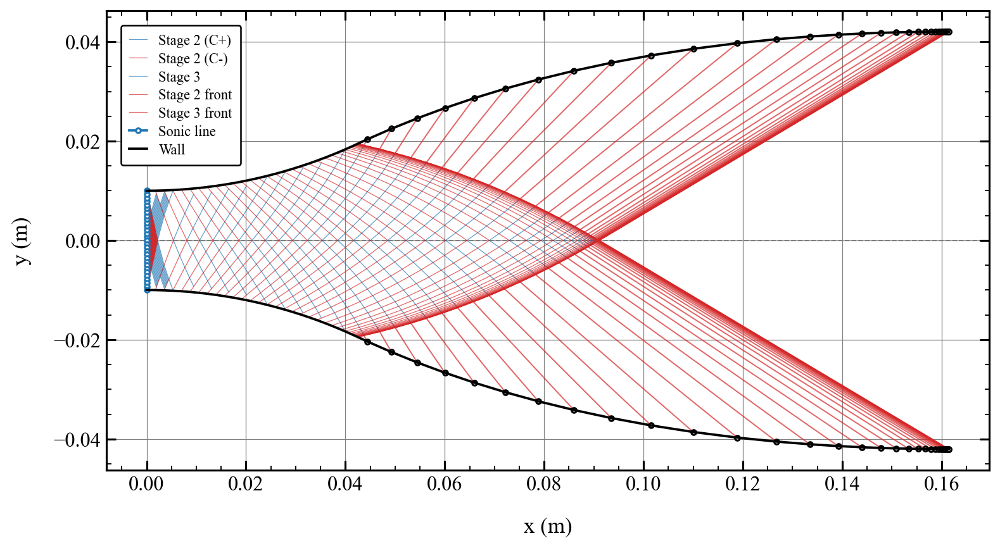
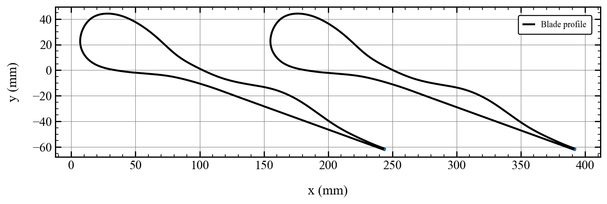

# TurboMoC

Method of Characteristics solver for supersonic nozzle and stator blade
design, built on a real-gas (CoolProp, via `jaxprop`) thermodynamic core.
Handles **single-phase, saturated two-phase, and subcooled-liquid
flashing / wet-to-dry inlets** under the Homogeneous Equilibrium Model
(HEM) assumption, on the same solver.




📦 **PyPI package**: [https://pypi.org/project/turbo_moc/](https://pypi.org/project/turbo_moc/)

📚 **Documentation**: [https://turbo-sim.github.io/TurboMoC/](https://turbo-sim.github.io/TurboMoC)


## Features

- **Two solver kernels**: `ConventionalSolver` (rounded-arc, supports the
  flashing flat post-jump throat front) and `MOCSolverMLN`
  (minimum-length, sharp-corner) nozzles.
- **`design_nozzle(...)`**: one function, plain arguments in, flat
  JSON-safe dict out.
- **Stator blade parametrization**: fit a closed B-spline blade profile
  from the nozzle wall and export to STEP (`turbo_moc.geometry`) -- two
  variants, full (pressure side mirrors the wall) and semi (pressure
  side is a single arc).
- **Interactive Dash app** for nozzle design and blade parametrization,
  with `matplotlib`/`plotly` plotting and design comparison.



## Install

With [Poetry](https://python-poetry.org/docs/#installation), install the
package and optional CadQuery support using:

```bash
poetry install --extras cad
```

Alternatively, install CadQuery through Conda Forge and let Poetry install the
package and its other runtime dependencies:

```bash
conda env create -f environment.yaml
conda activate turbo_moc_env
poetry install
```

## Quick start

```python
from turbo_moc import design_nozzle

data = design_nozzle(
    fluid_name="nitrogen",
    P0=20e5, T0=113.0,      # subcooled-liquid (flashing) inlet
    p_back=2e5,
    solver="conventional",   # or "mln"
    y_t=0.01, rho_t=0.2, rho_d=0.1,
)

wall = data["wall_final"]    # {"x": [...], "y": [...], "p": [...], "M": [...], ...}
```

```python
import turbo_moc

fig, ax = turbo_moc.mpl.plot_characteristics_mesh(data, mirror=True)
fig = turbo_moc.plotly.plot_nozzle_contour(data)
```

## Interactive app

```bash
python examples/run_app_local.py
```

Two tabs: nozzle design (Phase 1) and stator blade parametrization
(Phase 2, consuming Phase 1's result), each with interactive plots,
design comparison ("pin as reference"), and plot/STEP export.

## Repo layout

- `src/turbo_moc/core`, `src/turbo_moc/solvers` -- solver kernels
- `src/turbo_moc/api.py` -- `design_nozzle`
- `src/turbo_moc/geometry` -- stator blade parametrization + CAD export
- `src/turbo_moc/plotting_mpl.py`, `src/turbo_moc/plotting_plotly.py` -- plotting
- `src/turbo_moc/app.py` -- Dash app
- `examples/` -- runnable scripts
