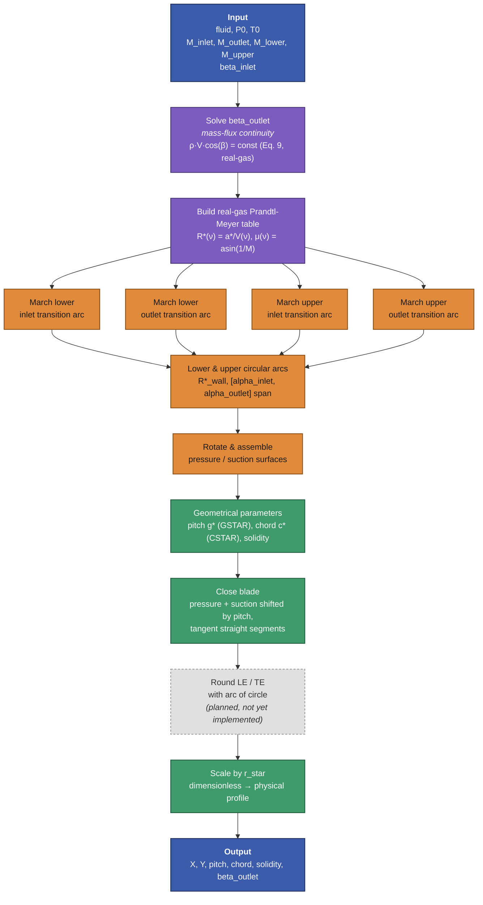
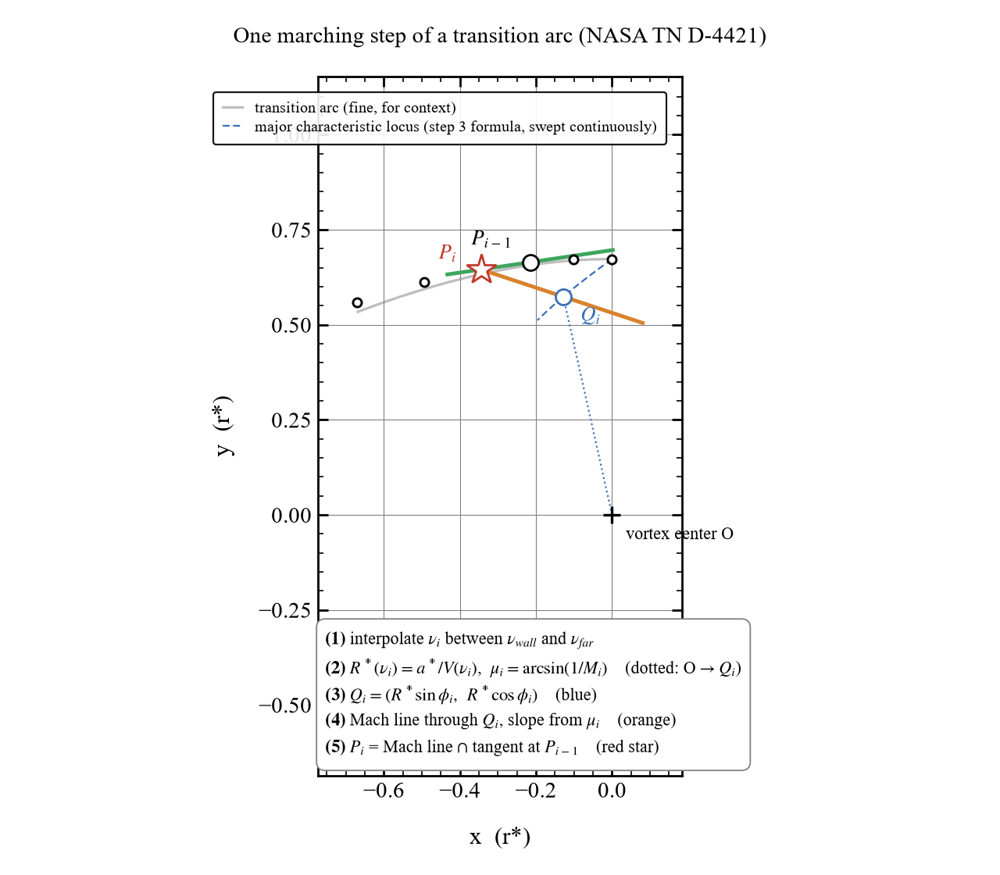

# Supersonic rotor blade design by the vortex-flow method

Implementation: [`turbo_moc.rotor.vortex_blade`](../src/turbo_moc/rotor/vortex_blade.py) —
`design_rotor_vortex_blade(...)`.

## Sources

1. **Boxer, E., Sterrett, J.R., Wlodarski, J. (1952).** "Application of
   Supersonic Vortex-Flow Theory to the Design of Supersonic Impulse
   Compressor- or Turbine-Blade Sections." NACA RM L52B06. The original
   method.
2. **Goldman, L.J., Scullin, V.J. (1968).** "Analytical Investigation of
   Supersonic Turbomachinery Blading, I – Computer Program for Blading
   Design." NASA TN D-4421. **The primary source for this implementation.**
   Contains the full FORTRAN listing and a worked numerical example
   (Table I input, Table II output) — this is what the module is validated
   against.
3. **Paniagua, G. et al. (2014).** "Design and analysis of pioneering high
   supersonic axial turbines." A modern re-derivation of the same method
   (shorter notation, Eqs. 1–19) applied to a high-supersonic turbine case,
   with CFD verification. **Not** an independent geometric method — see
   "Paniagua (2014) vs. TN D-4421" below for where its equations diverge
   from the FORTRAN and why the FORTRAN is trusted instead.
4. **Bufi, E.A., Cinnella, P. (2018).** Dense-gas generalization of the
   same method (DGMOC/RODEC) — the template this module follows for the
   real-gas generalization strategy, and originally also for taking
   `beta_outlet` as a free direct input rather than deriving it from
   Eq. 9; this module now derives it by default via a real-gas
   generalization of Eq. 9 instead (see "Why beta_inlet and beta_outlet
   can't be picked independently" below), while still allowing an
   explicit override for parity with Bufi & Cinnella's convention.

## Physical picture

A uniform inlet flow (angle `beta_inlet` from axial) is turned into a
supersonic free-vortex flow (`M·R = const`, `R` measured from a vortex
center) by an **inlet transition arc**, held at constant Mach number
through a **circular arc** concentric with that vortex center, then turned
back to uniform flow (`beta_outlet`) by an **outlet transition arc**. This
happens twice, independently, with two different constant Mach numbers
(`M_lower` on the pressure/concave side, `M_upper` on the suction/convex
side) — each surface has its own vortex center in general, though in this
implementation both come out centered at the same point (the local frame's
origin), since only rotations (no translations) are applied when placing
each surface.

```text
             circular arc (M_upper = const)
                    ___________
                   /           \
     inlet        /             \        outlet
  transition ----'               '---- transition
    arc  (upper)                    arc  (upper)


     inlet        .---------------.      outlet
  transition ----'   circular arc   '---- transition
    arc  (lower)   (M_lower = const)   arc  (lower)
```

## Pipeline overview



Color key: **blue** = input/output, **purple** = thermodynamic setup (fluid
table, continuity), **orange** = characteristics marching (the genuinely
iterative part), **green** = geometry assembly/derived quantities, **grey
dashed** = designed but not yet implemented (LE/TE rounding — see below).

## The two pieces of geometry, and which one is "just an arc"

**Circular arc (middle of each surface):** closed-form. Once the wall
radius `R*(M_wall) = a*/V(M_wall)` (from the constant-Mach/Prandtl-Meyer
relation) and the angular span `[alpha_inlet, alpha_outlet]` (from the
rotation equations below) are known, it's literally
`x = R*·sin(angle), y = R*·cos(angle)`.

**Transition arcs (inlet/outlet, connecting uniform flow to the constant-
Mach arc):** *not* closed-form — a genuine characteristics march. At each
step:

1. Interpolate the local Prandtl-Meyer angle `ν` between the far
   (uniform-flow) value and the wall value.
2. Convert `ν` to a local vortex radius `R*(ν)` and local Mach angle
   `μ = arcsin(1/M)`.
3. Compute a *reference point* on the "major vortex-expansion/compression
   characteristic" — `x = R·sin(φ), y = R·cos(φ)`, the same functional
   form as the final circular arc, but **this is not the wall**, only a
   construction aid for step 4.
4. Build the local Mach line through that reference point (slope from the
   averaged Mach angle + local flow angle of the current and previous
   step).
5. **Intersect that Mach line with the previous wall segment** — this
   intersection is the actual new wall point.

Step 5 is why the wall position can't be evaluated as a closed-form
function of `φ` or `ν` alone: each point depends on the previous one. This
recursive dependency is the whole method's numerically interesting part.



*One step, `i`, of the lower transition arc, `nu_inlet=39°`, `nu_lower=18°`
(the TN D-4421 Table II case), num_points=6 so individual steps are
visible. `P_{i-1}` is already-known (from the previous step, or the wall
point itself for the first step); `Q_i`, the Mach line, and `P_i` are all
computed fresh at step `i`. The dashed blue curve is the same
`Q = (R sinφ, R cosφ)` formula swept continuously — this is what Paniagua's
Eq. 17 draws, and why implementing it as "the wall" produces a curve that
cuts across the actual (kinked) marched points instead of following them.*
(Generated by `img/generate_marching_step_figure.py`.)

## Paniagua (2014) vs. TN D-4421 — what actually went wrong here

Two distinct issues, found by validating line-for-line against TN
D-4421's own Table II worked example:

- **Paniagua's Eq. 17** (`x* = -R·sin(φ), y* = R·cos(φ)`) reads like a
  closed-form wall-position formula. Implemented literally, it produces a
  visible, unphysical kink at the transition-arc/circular-arc junction.
  It is actually just step 3 above (the reference-point formula) —
  Paniagua's paper doesn't make the marching step (5) explicit.
- **Eq. 10b/13** (the perfect-gas `f(R*)` relation used to invert `ν` to
  `R*`): TN D-4421's FORTRAN has a `(γ+1)` term in the second arcsin;
  Paniagua's printed equivalent has `(γ-1)` there instead. Only the
  FORTRAN's `(γ+1)` form reproduces Table II — a genuine transcription
  difference between the two papers, not just a notational one.

Net effect: Paniagua (2014) doesn't introduce a new geometric method — the
equations are Boxer/Goldman-Scullin's, condensed. Its actual contribution
is applying the method to a new (very high supersonic, large-turning)
design point and validating the result with CFD, plus picking practical
values (e.g. a 5 mm leading/trailing-edge radius) the original method
leaves open. Because it's a derivative summary, it's also where errors
like the sign flip above hide — the 1968 primary source (FORTRAN + a
worked numerical example to check against) is trusted here instead.

## Key equations (as implemented, real-gas generalized)

- **Wall radius**: `R*(ν) = a*/V(ν)`, verified numerically equivalent to
  inverting TN D-4421's own perfect-gas `f(R*)` relation for the
  perfect-gas case, to 6 decimal places, once a test-harness bug in
  `a_of_V` was fixed (see "Validation" below).
- **Mach angle**: `μ = arcsin(1/M)`, `M = V/a_of_V(V)`.
- **Rotation (TN D-4421 Eqs. 6/7), lower (pressure) surface**:
  `alpha_inlet = (nu_inlet - nu_lower) - beta_inlet`,
  `alpha_outlet = -((nu_outlet - nu_lower) + beta_outlet)`.
- **Rotation, upper (suction) surface** (genuinely different sign
  convention from lower, not a mirror):
  `alpha_inlet = (nu_upper - nu_inlet) - beta_inlet`,
  `alpha_outlet = -((nu_upper - nu_outlet) + beta_outlet)`.
- **Pitch (`GSTAR`, "the dimensionless blade spacing")**: not a free
  input — derived from the geometry. Extend the suction surface's own
  inlet-far point along `beta_inlet` until it reaches the pressure
  surface's own inlet-far x-coordinate; the resulting y-gap is the pitch.
  Real-gas-agnostic (pure kinematics).
- **Chord (`CSTAR`)**: the pressure surface's own inlet-far-to-outlet-far
  Euclidean distance.
- **Solidity**: `chord / pitch`.

Real-gas generalization touches only `R*(ν)` and the Mach angle — the
marching recursion, the rotation formulas, and the pitch/chord/solidity
geometry are pure kinematics, unchanged by the thermodynamic model.
`beta_outlet` defaults to `None`, in which case it's derived from
`beta_inlet`/`M_inlet`/`M_outlet` via mass-flux continuity across the
transition (`ρ·V·cos(β) = const`) — the real-gas generalization of TN
D-4421's own Eq. 9 ("BETAT"), implemented in `_solve_beta_outlet` and
verified to reproduce Table II's `BETAT = -68.7395°` to 10+ significant
figures when evaluated with perfect-gas relations. An explicit value can
still be passed (Bufi & Cinnella's convention), but see "Why beta_inlet
and beta_outlet can't be picked independently" below for what happens if
it's inconsistent with continuity.

## What "pressure" and "suction" actually bound — read this before plotting

`pressure` and `suction` are **not** the two sides of one solid blade
closing into a simple polygon. Past their far corners the flow is
uniform, so each surface asymptotes to a straight line at
`beta_inlet`/`beta_outlet`; extending `suction`'s corners that way lands
exactly `pitch` short of `pressure`'s corners (by construction) and the
two extensions are parallel, so they never meet — the ordinary cascade
far-field picture, where *this* blade's suction surface runs parallel to
the *next* (pitch-shifted) blade's pressure surface, and together they
bound one flow passage.

The **blade** itself (the `"blade"` key in the returned dict) is built
differently: `pressure` (this blade, unshifted) joined to `suction`
**shifted by `+pitch`** (the *previous* blade's suction surface). This is
not an arbitrary closure — by the same algebra as the pitch derivation,
`pressure`'s own tangent continuation at each corner (slope exactly
`tan(beta_inlet)`/`tan(beta_outlet)`, i.e. its transition arc's own
far-end tangent, not an invented angle) lands *exactly* on
`suction`'s `+pitch`-shifted corner:

```text
y_last_i2 = pressure.y_inlet_far - tan(beta_inlet)*(pressure.x_inlet_far - suction.x_inlet_far)
          = suction.y_inlet_far + pitch      (substituting pitch's own definition)
```

So the straight segment closing `pressure` to `suction + pitch` *is* the
tangent line at each end — the blade comes to a genuine point there, not
a fabricated corner. The passage (where the transition-arc characteristics
actually live) is the mirror construction: `suction` (unshifted) paired
with `pressure` shifted by `-pitch`.

## Why beta_outlet is not a free input

`beta_inlet` and `beta_outlet` are not independent parameters for a given
`M_inlet`/`M_outlet` — mass has to be conserved across the transition,
which for this kind of 2D cascade means the axial-projected mass flux is
constant: `ρ_inlet·V_inlet·cos(β_inlet) = ρ_outlet·V_outlet·cos(β_outlet)`.
That's exactly TN D-4421's Eq. 9, just written without the perfect-gas
substitutions. `beta_outlet` is therefore **always derived** from this
relation (`_solve_beta_outlet`) rather than accepted as an input — an
earlier version of this module took it as a free parameter (matching
Bufi & Cinnella (2018)'s convention), but a `beta_outlet` inconsistent
with continuity doesn't just give "slightly wrong" geometry, it produces
a **self-intersecting wall** (the transition arc's rotation folds back
on itself, since the rotation angles `alpha_inlet`/`alpha_outlet`,
Eqs. 6/7, implicitly assume continuity-consistent turning) with no
warning that anything is wrong. Concretely: `M_inlet=M_outlet` with
`beta_inlet=0` has no consistent solution except `beta_outlet=0` — any
other value crosses. If a specific exit flow angle is the actual design
target, the right lever is `M_inlet`/`M_outlet` (which also sets the
degree of reaction — see below), not overriding `beta_outlet` directly.

### Degree of reaction

`M_inlet`/`M_outlet` (not `beta_inlet`) control the rotor's degree of
reaction. By rothalpy conservation (no radius change across a 2D blade
row), `h_inlet - h_outlet = (V_outlet² - V_inlet²)/2`, so:

- `M_outlet = M_inlet` → no static enthalpy drop across the rotor →
  pure impulse (R=0) — all of this module's originally-validated cases.
- `M_outlet ≠ M_inlet` → the rotor itself does some of the expansion →
  reacting blade. Continuity then also makes `beta_outlet` differ from
  `beta_inlet` in *magnitude*, not just sign — with `M_inlet=M_outlet`,
  continuity only ever admits `beta_outlet=±beta_inlet` (the mirror
  branch is the "ordinary" impulse convention, e.g. `beta_inlet=65°,
  beta_outlet=-65°`; that works "for free," by algebra, not because
  continuity is being ignored — TN D-4421's Table II case, where
  `M_inlet≠M_outlet`, is a different situation: `beta_outlet=-68.7395°`
  is *not* `-beta_inlet` there, it's a genuinely solved value from Eq. 9).

This module only ever sees the rotor in isolation, so it can report the
rotor's own static enthalpy change but not a full-stage `R = Δh_rotor /
Δh_stage` (that needs the stator's enthalpy drop too, from outside this
module).

Two related, narrower limitations found while testing this — both
produce a small residual self-crossing even with a continuity-consistent
`beta_outlet`, so they're separate from the issue above, not solved by
it:

- **`M_inlet` exactly equal to `M_outlet`** together with
  `beta_inlet=beta_outlet` (a fully mirror-symmetric case) still shows a
  small crossing right at the arc's midpoint — the inlet and outlet
  transition arcs become exact mirror images of each other (confirmed
  algebraically: `_rotate_outlet` at `alpha=-A` maps the same local arc
  used by `_rotate_inlet` at `alpha=+A` to `(x,y) -> (-x,y)`), and they
  don't hand off with enforced tangent continuity exactly at that meeting
  point. Using `M_inlet` and `M_outlet` that differ even slightly avoids
  this.
- **A large Prandtl-Meyer swing on one surface** (e.g. `M_upper` far from
  both `M_inlet` and `M_outlet`) can still produce a self-crossing
  transition arc on that surface alone, independent of `beta_outlet` —
  the marching (intersecting each Mach line with the previous wall
  tangent) isn't guaranteed to stay monotonic when the turning per step
  is too aggressive relative to `num_points`. Not yet root-caused;
  increasing `num_points` or moderating how far `M_upper`/`M_lower` sit
  from `M_inlet`/`M_outlet` are the current workarounds.

## Validation

Against TN D-4421's Table II (perfect gas, γ=1.4, `beta_inlet=65°`,
`nu_inlet=39°`, `nu_outlet=35°`, `nu_lower=18°`, `nu_upper=59°`):
`pitch = 0.55441` (expect 0.5544), `chord = 1.62801` (expect 1.6281),
`beta_outlet = -68.73948°` (expect -68.7395°), individual transition-arc
coordinates matching point-for-point. The paper's own printed
`SIGMA = 2.5367` is inconsistent with its own printed `CSTAR`/`GSTAR`
(`1.6281/0.5544 = 2.9367 ≠ 2.5367`) — concluded to be an OCR/scanning
error in the 1968 document, not a bug here (this module's independently
validated `CSTAR` and `GSTAR` match the paper exactly, and their own
ratio is self-consistent at 2.9367).

A subtle bug found *during* validation: an early standalone perfect-gas
test harness hardcoded `a_of_V(V) = 1.0` (constant) — physically wrong,
since local speed of sound varies with velocity along a perfect-gas
isentrope. This broke the `M(V)` relation even though the underlying
`R* = a*/V(ν)` equivalence was correct, and masked itself as a ~0.85 vs.
0.554 pitch mismatch that did *not* converge away with finer
discretization (ruling out truncation error as the cause). Fixed by
implementing `a_star = 1/sqrt(gamp1)`, `a_of_V(V) = sqrt(1 - gamm1·V²)`,
consistent with an `a0 = 1` stagnation normalization.

## Open / not implemented

- **Leading/trailing-edge rounding.** TN D-4421 mentions straight closing
  segments (`BE`, `GJ` in its Fig. 1) and rounding but gives no formula
  for their size — Paniagua (2014) just picks 5 mm. This module's
  `"blade"` closure is a sharp point (the tangent lines' actual
  intersection), not rounded.
- **The two residual self-crossing cases** described above (exact
  `M_inlet=M_outlet` with symmetric betas; a large Prandtl-Meyer swing on
  one surface) aren't root-caused/fixed yet, just documented as known
  limitations with workarounds.
